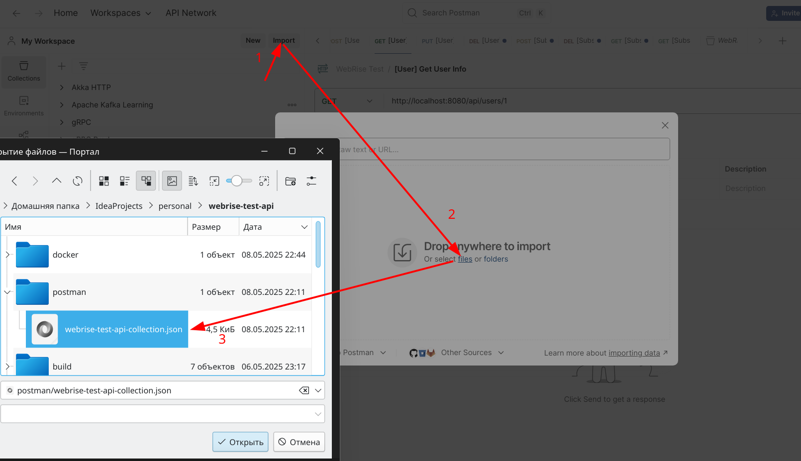

# WEBRise - Тестовое задание на позицию Java-разработчика.
## Микросервис для работы с пользователями и их подписками

## Запуск
#### Запуск всей инфраструктуры приложения(PostgreSQL+API)
```bash
docker-compose up -d
```
Приложение будет запущено на порту 8080

#### [Optional] Запуск PostgreSQL в Docker
```bash
docker-compose up -d subscription-db
```

## Тестирование
В папке postman хранится коллекция Postman с готовыми запросами.
Чтобы использовать её, нужно импортировать .json файл:


